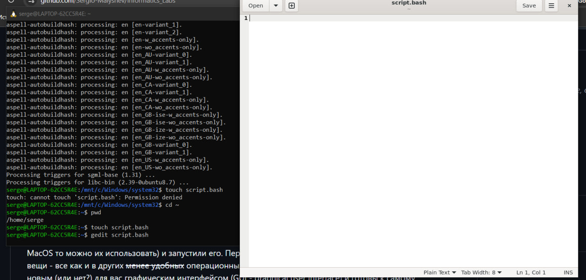

# Лабораторная работа 1 — С чего начинается Linux? С Терминала!

Студент: [Малышев Сергей Александрович]  
Группа: [K3339]  
Дата: [09.03.2026]

## Цель работы
Ознакомиться с основами работы в терминале Linux, научиться создавать и запускать bash-скрипты, передавать аргументы в скрипт.

## Ход работы

### 1. Установка окружения
- ОС: Windows 11 + WSL 2 (Ubuntu)
- Команда установки: wsl --install -d Ubuntu
- После перезагрузки задал имя пользователя и пароль


### 2. Подготовка системы
```
sudo apt update
sudo apt upgrade -y
sudo apt install gedit -y
```


<p align="center">
  
  <br><br>
  <em>Создаем скрипт</em>
</p>

### 3. Создание скрипта
```
if [ $# -eq 0 ]; then
    echo "Welcome to ITMO University"
else
    echo "Welcome, $*"
fi
```

<p align="center">
  
  <br><br>
  <em>Демонстрируем скрипт</em>
</p>


<p align="center">
  
  <br><br>
  <em>Демонстрируем работу скрипта</em>
</p>
